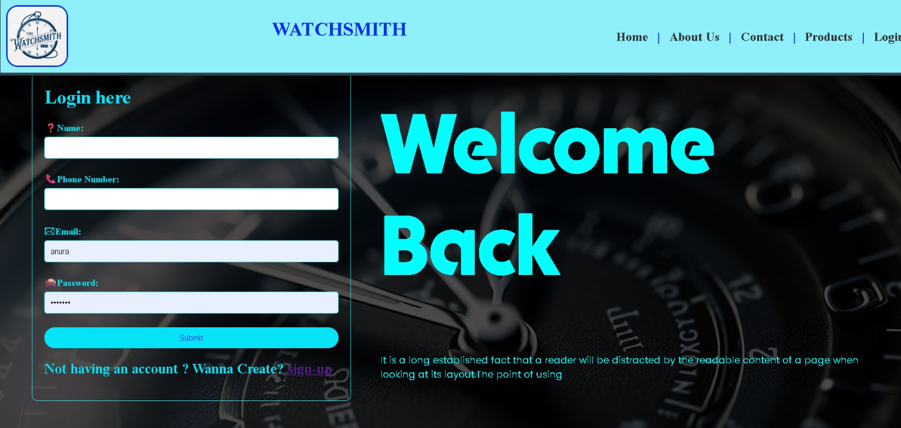
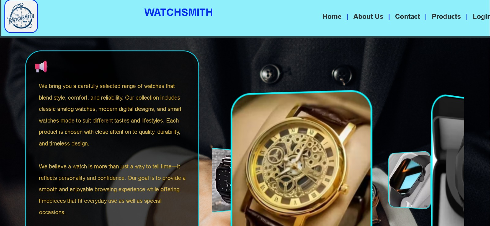
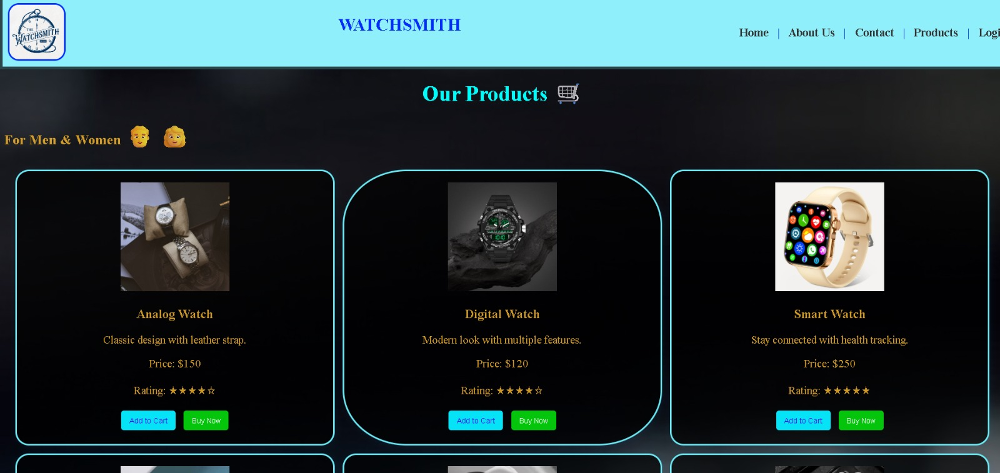

<h1 align="center">Hi 👋, I'm Anusuya R</h1>
<h3 align="center">Aspiring Software Developer from Chennai, India 🇮🇳</h3>

---

## 👩‍💻 About Me

💙 Computer Science Student  
🎓 St. Joseph's College of Engineering, Chennai (CGPA: 8.86)  
💡 Passionate about solving real-world problems through Java and Web Development.  

🔭 Building responsive web applications  
🌱 Learning Java, DSA, and Web Development  
💡 Interested in Software Engineering and Problem Solving  
🎯 Goal: Become a Software Development Engineer  

⚡ Fun Fact: I enjoy turning ideas into interactive web applications.  

 

---

## 🚀 Quick Overview

- 🎓 B.E. Computer Science Engineering @ St. Joseph's College of Engineering
- 💻 Interested in Java, DSA & Web Development
- 🌱 Currently learning Data Structures & Algorithms
- 📍 Chennai, Tamil Nadu, India
- 📫 Reach me at: **anusuya.ramu18@gmail.com**

---

## 🌐 Connect

---

## 💻 Tech Stack

---

## 🎯 Currently Working On

- 📚 Strengthening Data Structures & Algorithms
- ☕ Building Java projects
- 🌐 Learning web development technologies
- 💻 Solving coding problems consistently
- 🚀 Contributing to GitHub every week

---

## 💼 Experience

### 🏢 Front-End Developer Intern 
**Redite (formerly Fazo Software)** • May 2026 – June 2026  
- Built responsive UI components using HTML and CSS.
- Improved user experience through clean and intuitive design.

### 🏢 Front-End Intern 
**CIRF, Chennai** • Assisted in developing web pages and improving layout responsiveness.

---

## 🚀 Projects

### 🎮 [Sudoku Arena](https://github.com/Anusuya-Ramu/Sudoku-Arena)
- **Tech Stack:** `HTML` `CSS` `JavaScript` `Firebase`
- **⭐ Features**
  - Developed an interactive Sudoku game with dynamic grid generation and validation logic.
  - Integrated Firebase for real-time storage of user progress and scores.
  - Designed a responsive UI with input validation, error highlighting, and reset functionality.

🎥 **Video Demo:**

  

- **📊 Repository Status:**  
- **🔗 Links:** [GitHub Repository](https://github.com/Anusuya-Ramu/Sudoku-Arena)

---

### ⌚ [Watchsmith](https://github.com/Anusuya-Ramu/Watch_Mini_Project)
- **Tech Stack:** `HTML` `CSS`
- **⭐ Features**
  - Developed a responsive front-end interface for an online watch store.
  - Designed user-friendly navigation and product display layout.
  - Optimized website responsiveness for different screen sizes.

📸 **Preview:**

  
  

  

- **📊 Repository Status:**  
- **🔗 Links:** [GitHub Repository](https://github.com/Anusuya-Ramu/Watch_Mini_Project)

---

## 🏆 Achievements

- 🏆 **CGPA:** 8.86 (B.E CSE, St. Joseph's College of Engineering)
- 💻 **Java & Frontend Developer:** Built dynamic, responsive web apps and strong programming foundations
- 📚 **NPTEL Certified:** Multiple certifications in core technical subjects
- 🔥 **Frontend Intern Experience:** Hands-on industry experience at Redite and CIRF
- 🚀 **DSA Enthusiast:** Regularly practicing Data Structures & Algorithms through online coding platforms

---

## 📊 Activity Graph

---

## 🏅 LeetCode Card

---

## 📜 Certifications

* **Python for Data Science** – NPTEL
* **Programming in C** – NPTEL
* **DBMS** – NPTEL
* **Java Programming** – Infosys Springboard
* **Programming in Python** – Infosys Springboard

---

✨ Thanks for visiting my profile! Let's connect and build something amazing together. 🚀

